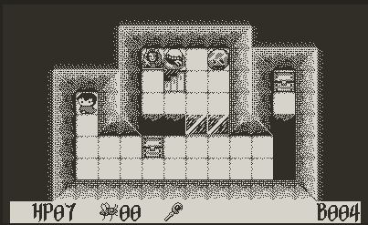

# PDStranger

*Playdate game engine inspired by [Void Stranger](https://system-erasure.itch.io/void-stranger)*

Includes all the base game mechanics found in the original, and a few dozen (all original) levels.

All graphics are original to this project, based on *Void Stranger* by System Erasure. Music by [eebrozgi](https://bsky.app/profile/eebrozgi.bsky.social/post/3moi2afspv22b). SFX copied wholesale from the original game. To the author's knowledge, no file in this repo (including code and images) contains output from any generative AI models.

Contributions welcome.